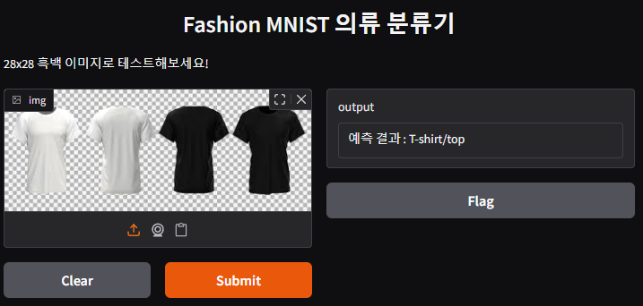

# 🧠 FashionMNIST 이미지 분류 웹 데모

PyTorch로 CNN 모델을 학습하고, Gradio를 통해 사용자가 이미지를 업로드하면 예측 결과를 알려주는 간단한 웹 애플리케이션입니다.

---

## 📁 프로젝트 구조
FashionMNIST/
├── train_model.py # CNN 모델 학습 및 저장
├── app.py # Gradio 웹 인터페이스
├── data/ # FashionMNIST ubyte 데이터
├── .gitignore
├── screenshot.png # 실행 화면 캡처 이미지 (직접 저장 필요)
└── README.md

---

## ✅ 실행 방법

1. 필요한 라이브러리 설치
```python
pip install torch torchvision gradio numpy
```
2. 모델 학습
```python
python train_model.py
```
3. 웹 앱 실행
```python
python app.py
```
4. 브라우저 열기
자동으로 웹 브라우저가 열리며, http://127.0.0.1:7860 주소에서도 접근할 수 있습니다.

## 웹 실행 화면
아래는 웹 앱을 실행한 후, 이미지를 업로드하고 예측 결과를 확인하는 모습입니다.


## 사용 기술
PyTorch: 모델 구현 및 학습
CNN (Convolutional Neural Network): 이미지 분류
Gradio: 웹 인터페이스 구성

## 프로젝트 목표
FashionMNIST를 사용한 CNN 모델 학습
학습한 모델을 저장하고 불러오기
웹에서 사용자 이미지 업로드 → 분류 결과 예측

